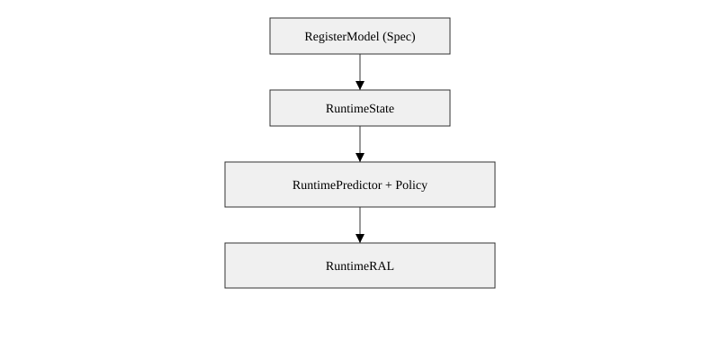

# cocotbext-ral

A Python-native Register Abstraction Layer (RAL) for [cocotb](https://www.cocotb.org/).

`cocotbext-ral` brings a UVM-like register model experience into cocotb — without the rigidity of SystemVerilog or the overhead of traditional UVM RAL.

It is designed to be:
- data-driven — clean separation of register spec vs runtime state
- Pythonic — simple, inspectable, extensible
- practical — works today with cocotbext AXI/APB
- extensible — supports custom access semantics, backdoor mapping, and advanced DV flows

## Highlights

- **Runtime-backed architecture** with clear spec/state separation
- **Safe field writes** that reject unsafe read-modify-write sequences
- **Backdoor resolution** that scales to replicated blocks and chiplets
- **Legacy compatibility** for teams migrating from a traditional UVM-style API
- **Pure-Python introspection** for debug, tooling, and future AI-assisted flows

## Architecture



For a deeper explanation, see [docs/ARCHITECTURE.md](docs/ARCHITECTURE.md), [docs/API.md](docs/API.md), and [DESIGN.md](DESIGN.md).

## Why use this?

In cocotb environments, register handling is usually ad hoc or over-engineered. This project aims for the middle ground:
- familiar API patterns for DV engineers coming from UVM
- pure-Python data structures that are easy to inspect, test, and extend
- a runtime-state architecture that scales better to replicated IP and chiplets

## Installation

```bash
pip install cocotbext-ral
```

Optional extras:

```bash
pip install cocotbext-ral[cocotb]
pip install cocotbext-ral[rdl]
pip install cocotbext-ral[all]
```

## Quick start

```python
import cocotb
from cocotbext.axi import AxiLiteMaster, AxiLiteBus
from cocotbext.ral import RAL
from cocotbext.ral.adapters import load_json

@cocotb.test()
async def test_registers(dut):
    model = load_json("registers.json")
    ral = RAL("my_ip", model, dut_handle=dut)
    master = AxiLiteMaster(AxiLiteBus.from_prefix(dut, "s_axil"), dut.clk, dut.rst)
    ral.attach_master(master, protocol="axil")

    await ral.write("CTRL", 1)
    val = await ral.read("CTRL")
    await ral.write_field("CTRL", "enable", 1)
    en = await ral.read_field("CTRL", "enable")
    ral.raise_on_errors()
```

## Runtime-backed architecture

The project also includes a newer runtime-backed path that separates structural register spec from mutable runtime state.

```text
RegisterModel (spec)
        ↓
    RuntimeState
        ↓
RuntimePredictor + AccessPolicy
        ↓
   RuntimeRAL / SafeRuntimeRAL / IntegratedRuntimeRAL
```

Use this path if you want:
- multiple live RAL instances from one spec
- safer field-write behavior
- pluggable backdoor resolution
- future-ready extensibility

See `examples/basic_runtime_ral.py`, `examples/axil_cocotb_demo.py`, `docs/ARCHITECTURE.md`, and `DESIGN.md`.

## Choosing an API

- `RAL` — simplest stable cocotb-facing API (legacy path)
- `RuntimeRAL` — runtime-backed architecture
- `SafeRuntimeRAL` — runtime-backed plus conservative RMW protection
- `IntegratedRuntimeRAL` — runtime-backed plus backdoor resolver and debug helpers

## API Documentation

See [docs/API.md](docs/API.md) for a practical API reference covering:
- core model classes
- legacy / stable APIs
- runtime-backed APIs
- backdoor helpers
- debug helpers
- loaders and common imports

## Status

The classic `RAL` path remains the conservative option.
The runtime-backed classes are the forward-looking direction for the project.

## Contributing

See `CONTRIBUTING.md`.

## License

MIT
